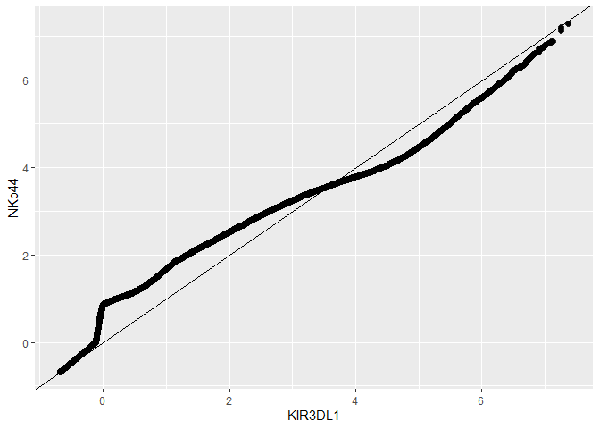

AFUNDAR_FA1
================
Audrie Lex L. Afundar
2025-01-30

## Number 1

Choose one of the columns of the dataset and make at least two plots
showing its distribution (choose from ECDF, quantile, histogram, density
estimate). What does the plot tell you about the distribution of the
values in that column?

## ECDF

``` r
column_data<-"KIR3DL1"
ggplot(dataset, aes(x=.data[[column_data]]))+stat_ecdf()+labs(x = column_data, y = "ECDF", title = paste("ECDF of", column_data))
```

<!-- --> In
the ECDF plot, the y level indicates the cumulutive fraction of
distributions while the x axis shows the expression level of KIR3DL1. In
the context of cytof, the graph indicates a spike/rise near 0 suggesting
a low expression level of KIR3DL1.

## Histogram

``` r
ggplot(dataset, aes(x=.data[[column_data]]))+geom_histogram(binwidth=0.1)+
  labs(title = paste("Histogram of", column_data), x = column_data, y = "Frequency")
```

<!-- -->
The histogram having a right skewed distribution strongly suggests a low
expression level of KIR3DL1 on the experimented cells. Moreover, the
tail part of the graphs shows a moderately high expression level of
KIR3DL1. Paired with the ECDF (Showing that more than 50% is in the
lower levels), it paints a much clearer that most cells have a low
expression level while there are sub groups with moderate-high levels of
KIR3DL1.

## Number 2

Choose any two of the columns of the dataset and make a Q-Q plot
comparing the distributions. What does the Q-Q plot tell you about
similarities or differences between the distributions of the values in
the two columns?

## Q-Q plot

``` r
column_data1<-"NKp44"
qq.df=as.data.frame(qqplot(dataset[[column_data]],dataset[[column_data1]]),plot.it=FALSE)
```

<!-- -->

``` r
ggplot(qq.df,aes(x=x,y=y))+geom_point()+xlab("KIR3DL1")+ylab("NKp44")+geom_abline()+geom_point(alpha = 0.6, size = 2)
```

<!-- -->

The Q-Q plot is comparing the distribution of NKp44 and KIR3DL1
expression levels. The plot clearly shows a non perfect linear
relationship, meaning a strong deviation on the expression levels. The
curves on the plot suggests higher low or no expression levels on both
axis.
