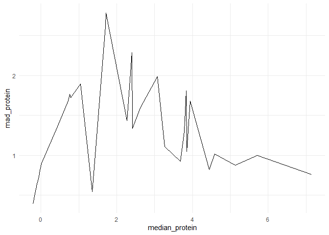
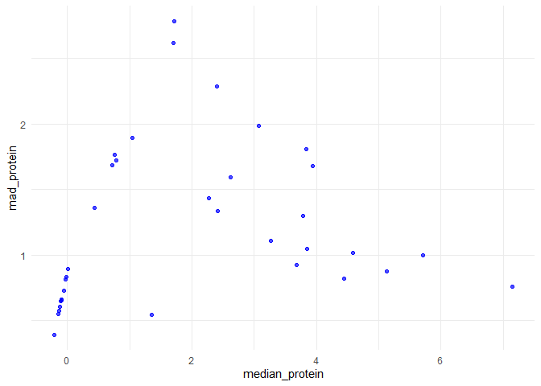

FA2_AFUNDAR_EDA
================
Audrie Lex L. Afundar
2025-02-12

Using the CyTOF data

``` r
dataset<-read.csv("C:/Users/Audrie Lex Afundar/Downloads/cytof_one_experiment.csv")
```

## Number 1

Use pivot_longer to reshape the dataset into one that has two columns,
the first giving the protein identity and the second giving the amount
of the protein in one of the cells. The dataset you get should have
1750000 rows (50000 cells in the original dataset times 35 proteins).

``` r
pivoted <- dataset %>%
  pivot_longer(cols = everything(), names_to = "Protein", values_to = "Count")

pivoted
```

    ## # A tibble: 1,750,000 × 2
    ##    Protein    Count
    ##    <chr>      <dbl>
    ##  1 NKp30      0.188
    ##  2 KIR3DL1    3.62 
    ##  3 NKp44     -0.561
    ##  4 KIR2DL1   -0.294
    ##  5 GranzymeB  2.48 
    ##  6 CXCR6     -0.145
    ##  7 CD161     -0.315
    ##  8 KIR2DS4    1.94 
    ##  9 NKp46      4.08 
    ## 10 NKG2D      2.62 
    ## # ℹ 1,749,990 more rows

## Number 2

Use group_by and summarise to find the median protein level and the
median absolute deviation of the protein level for each marker. (Use the
R functions median and mad).

Using the pivoted dataset we get:

``` r
median_by_protein <- pivoted %>%
  group_by(Protein) %>%
  summarize(
    median_protein = median(Count, na.rm = TRUE),
    mad_protein = mad(Count, na.rm = TRUE)  
  )
median_by_protein
```

    ## # A tibble: 35 × 3
    ##    Protein median_protein mad_protein
    ##    <chr>            <dbl>       <dbl>
    ##  1 CD107a         -0.122        0.609
    ##  2 CD16            5.12         0.874
    ##  3 CD161           0.726        1.69 
    ##  4 CD2             3.95         1.68 
    ##  5 CD4            -0.204        0.395
    ##  6 CD56            5.71         0.998
    ##  7 CD57            3.07         1.99 
    ##  8 CD69            4.59         1.02 
    ##  9 CD8             2.40         2.29 
    ## 10 CXCR6          -0.0581       0.727
    ## # ℹ 25 more rows

## Number 3

Make a plot with mad on the x-axis and median on the y-axis. This is
known as a spreadlocation (s-l) plot. What does it tell you about the
relationship betwen the median and the mad?

## Line Plot

``` r
ggplot(data = median_by_protein) +
  geom_line(mapping = aes(x = median_protein, y = mad_protein)) + 
  theme_minimal()
```

<!-- -->

## Scatter Plot

``` r
ggplot(median_by_protein, aes(x = median_protein, y = mad_protein)) +
  geom_point(color = "blue", alpha = 0.7) +
  theme_minimal()
```

<!-- -->

Considering the points, there are no apparent linear relationship
between the proteins. For lower median protein, the MAD is are
relatively high. This can indicate that lower expression levels of
protein tend to have more variability. Moreover, there also high
expression levels of protein which has a more stable MAD, indicating
stable variability across the measurements. By the figure, there are
also very high MAD while having low expression levels suggesting of
further studies among them.

## Number 4

Load the dataset example_gymnastics_2 using the command
data(example_gymnastics_2). Notice that the column names are of the form
event_year.

Using either pivot_longer on its own or pivot_longer in combination with
separate, reshape the dataset so that it has columns for country, event,
year, and score.

``` r
data(example_gymnastics_2)

example_gymnastics_2 %>%
  pivot_longer(cols = -country, names_to = c("event", "year"), names_sep = "_", values_to = "score")
```

    ## # A tibble: 12 × 4
    ##    country       event year  score
    ##    <chr>         <chr> <chr> <dbl>
    ##  1 United States vault 2012   48.1
    ##  2 United States floor 2012   45.4
    ##  3 United States vault 2016   46.9
    ##  4 United States floor 2016   46.0
    ##  5 Russia        vault 2012   46.4
    ##  6 Russia        floor 2012   41.6
    ##  7 Russia        vault 2016   45.7
    ##  8 Russia        floor 2016   42.0
    ##  9 China         vault 2012   44.3
    ## 10 China         floor 2012   40.8
    ## 11 China         vault 2016   44.3
    ## 12 China         floor 2016   42.1
