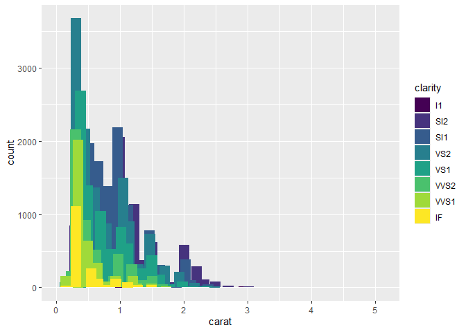

FA3_AFUNDAR_EDA
================
Audrie Lex L. Afundar
2025-02-27

## Number 1

Create a histogram on the diamonds dataset, for example with

ggplot() + geom_histogram(aes(x = carat), data = diamonds)

``` r
ggplot() + geom_histogram(aes(x = carat), data = diamonds)
```

    ## `stat_bin()` using `bins = 30`. Pick better value with `binwidth`.

<!-- -->

Re-write this using the layer function like we did in class. Hint: if
you don’t know what tthe default values for some of the aspects of the
plot, examine p\$layers.

``` r
ggplot(diamonds) + 
  layer(
    geom="bar",
    stat="bin",
    position="stack",
    mapping= aes(x=carat)
  )
```

    ## `stat_bin()` using `bins = 30`. Pick better value with `binwidth`.

<!-- -->

## Number 2

Remember that a histogram is a plot with stat_bin and geom_bar. Modify
your histogram code so that it uses a different geom, for example
geom_line or geom_point. This should be simple once you have the layer
specification of a histogram.

``` r
ggplot(diamonds) + 
  layer(
    geom="line",
    stat="bin",
    position="stack",
    mapping= aes(x=carat)
  )
```

    ## `stat_bin()` using `bins = 30`. Pick better value with `binwidth`.

<!-- -->

``` r
ggplot(diamonds) + 
  layer(
    geom="point",
    stat="bin",
    position="stack",
    mapping= aes(x=carat)
  )
```

    ## `stat_bin()` using `bins = 30`. Pick better value with `binwidth`.

<!-- --> \##
Number 3

In your histogram (the one plotted with bars that you created in
question 1), add an aesthetic mapping from one of the factor variables
(maybe color or clarity) to the fill or color aesthetic.

``` r
ggplot(diamonds) + 
  layer(
    geom="bar",
    stat="bin",
    position="stack",
    mapping= aes(x=carat, fill=clarity)
  )
```

    ## `stat_bin()` using `bins = 30`. Pick better value with `binwidth`.

<!-- -->

## Number 4

What is the default position adjustment for a histogram? Try changing
the position adjustment in the histogram you created in question 3 to
something different (hint: try dodge).

The default position adjustment for histogram would be stack where the
bars are stacked on top of each other.

``` r
ggplot(diamonds) + 
  layer(
    geom="bar",
    stat="bin",
    position="jitter",
    mapping= aes(x=carat, fill=clarity)
  )
```

    ## `stat_bin()` using `bins = 30`. Pick better value with `binwidth`.

<!-- -->

``` r
ggplot(diamonds) + 
  layer(
    geom="bar",
    stat="bin",
    position="dodge",
    mapping= aes(x=carat, fill=clarity)
  )
```

    ## `stat_bin()` using `bins = 30`. Pick better value with `binwidth`.

<!-- -->
