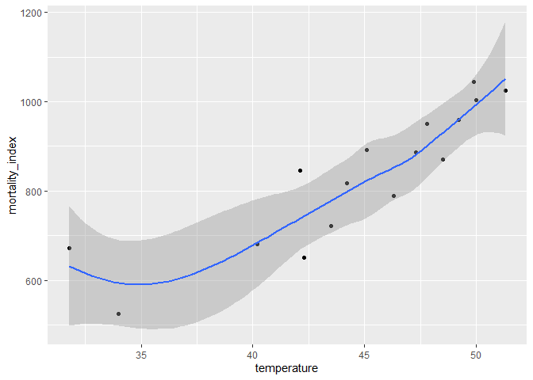
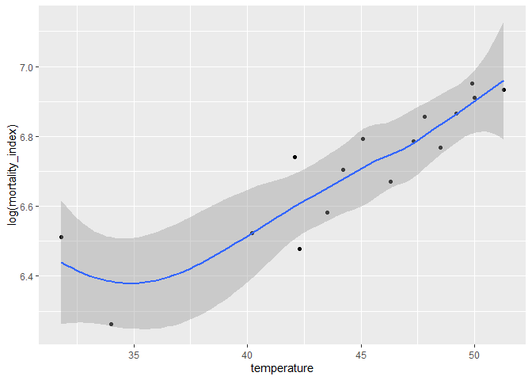
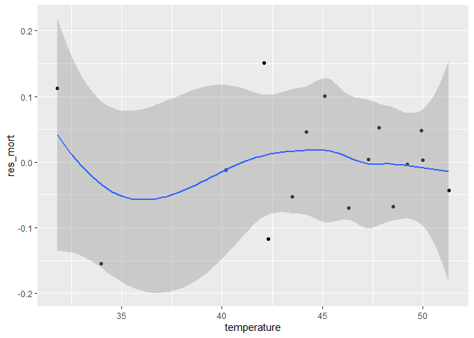
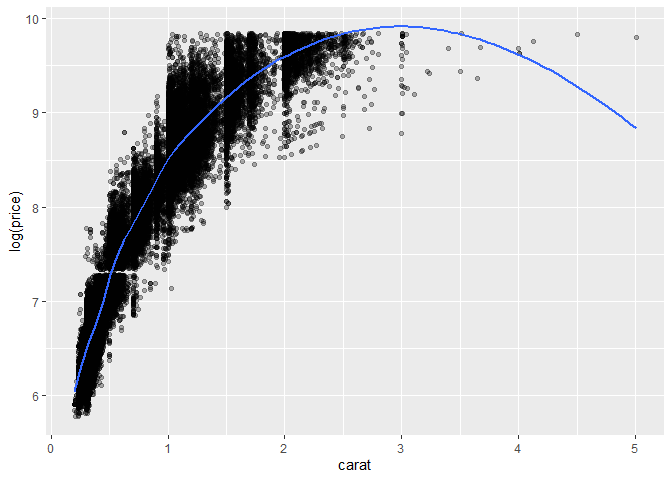
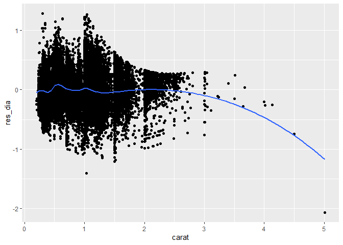
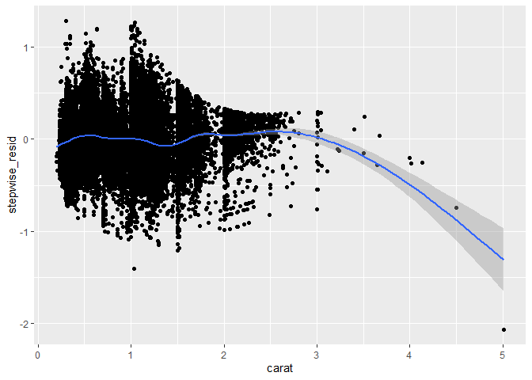
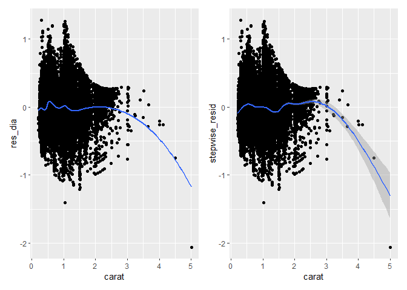

FA4_AFUNDAR_EDA
================
Audrie Lex L. Afundar
2025-03-05

Using the Mortality by Latitude data Download Mortality by Latitude
data, make a plot of mortality index against mean average temperature.
Is it hollow up or hollow down? Try to identify a transformation of one
of the variables that will straighten out the relationship, and make a
plot of the residuals to check for any remaining patterns.

``` r
dataset<-read.csv("D:/Download folder/mortality_by_latitude.csv")

ggplot(dataset, aes(x = temperature, y = mortality_index)) +
  geom_point() +
  geom_smooth(method = "loess")
```

    ## `geom_smooth()` using formula = 'y ~ x'

<!-- --> The
plot of mortality rate vs the mean of the temperature is hollow up,
indidcating that as temperature increases, the mortality rate also
increases.

Finding the residuals and straigthening it out.

``` r
ggplot(dataset, aes(x = temperature, y = log(mortality_index))) +
  geom_point()+
  geom_smooth(method = "loess")
```

    ## `geom_smooth()` using formula = 'y ~ x'

<!-- -->

``` r
model <- lm(log(mortality_index)~poly(temperature, 2),data=dataset)
res_mort <- resid(model)
dataset$res_mort<-res_mort

ggplot(dataset, aes(x = temperature, y = res_mort)) +
  geom_point() +
  geom_smooth(method = "loess", se=TRUE)
```

    ## `geom_smooth()` using formula = 'y ~ x'

<!-- -->
Using the same subset of the diamonds dataset, make a plot of log price
as a function of carat with a loess smoother. Try several values for the
span and degree arguments and comment briefly about your choice.

``` r
data(diamonds)

ggplot(diamonds, aes(x = carat, y = log(price))) +
  geom_point(alpha = 0.3) +
  geom_smooth(method = "loess", span = 0.4, se = FALSE)
```

    ## `geom_smooth()` using formula = 'y ~ x'

<!-- --> I
choosed span 0.4 as although it is not as smooth, it captures local
fluctuations thus good for detecting patterns.

Compare the fit of the loess smoother to the fit of the polynomial +
step function regression using a plot of the residuals in the two
models. Which one is more faithful to the data?

## Loess

``` r
model_dia<-lm(log(price)~poly(carat, 3), data=diamonds)
res_dia <- resid(model_dia)
diamonds$res_dia <- res_dia


loess<-ggplot(diamonds, aes(x=carat, y=res_dia)) +
  geom_point()+
  geom_smooth(method="loess", span=0.4, se=FALSE)

loess
```

    ## `geom_smooth()` using formula = 'y ~ x'

<!-- -->

## Step-wise regression

``` r
stepwise<-step(model_dia, direction="both")
```

    ## Start:  AIC=-146210.1
    ## log(price) ~ poly(carat, 3)
    ## 
    ##                  Df Sum of Sq   RSS     AIC
    ## <none>                         3586 -146210
    ## - poly(carat, 3)  3     51945 55531    1570

``` r
diamonds$stepwise_resid<-resid(stepwise)

stepwise<-ggplot(diamonds, aes(x=carat, y=stepwise_resid))+
  geom_point()+
  geom_smooth()

stepwise
```

    ## `geom_smooth()` using method = 'gam' and formula = 'y ~ s(x, bs = "cs")'

<!-- -->

``` r
loess+stepwise
```

    ## `geom_smooth()` using formula = 'y ~ x'
    ## `geom_smooth()` using method = 'gam' and formula = 'y ~ s(x, bs = "cs")'

<!-- -->

Based on their plots, loess (left) is more faithful in the data. It’s
not overfitting and capsulates it more specifically rather than the
step-wise regression with a more generalized plot.
