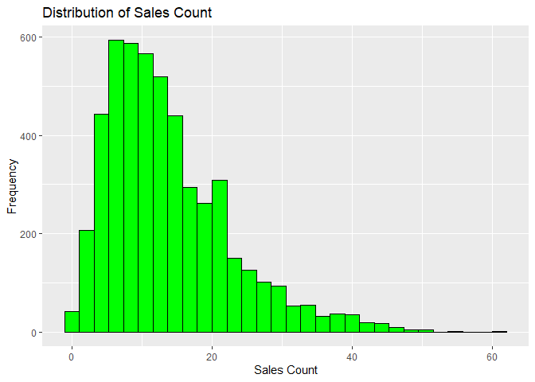
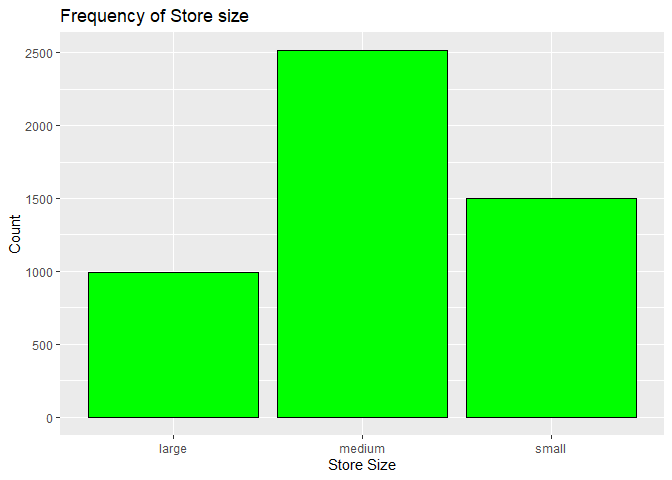

FA5_AFUNDAR_EDA
================
Audrie Lex L. Afundar
2025-04-28

## Load and Explore the Data

``` r
store_sale<-read.csv("D:/Download folder/store_sales_data.csv")

head(store_sale)
```

    ##   day_of_week promo holiday store_size sales_count
    ## 1           6     0       0     medium          18
    ## 2           3     0       0     medium          13
    ## 3           4     0       0      large          24
    ## 4           6     1       0      small          16
    ## 5           2     0       0     medium          11
    ## 6           4     0       1     medium          13

``` r
summary(store_sale)
```

    ##   day_of_week        promo           holiday        store_size       
    ##  Min.   :0.000   Min.   :0.0000   Min.   :0.0000   Length:5000       
    ##  1st Qu.:1.000   1st Qu.:0.0000   1st Qu.:0.0000   Class :character  
    ##  Median :3.000   Median :0.0000   Median :0.0000   Mode  :character  
    ##  Mean   :2.985   Mean   :0.3012   Mean   :0.0956                     
    ##  3rd Qu.:5.000   3rd Qu.:1.0000   3rd Qu.:0.0000                     
    ##  Max.   :6.000   Max.   :1.0000   Max.   :1.0000                     
    ##   sales_count   
    ##  Min.   : 0.00  
    ##  1st Qu.: 7.00  
    ##  Median :12.00  
    ##  Mean   :13.73  
    ##  3rd Qu.:18.00  
    ##  Max.   :61.00

``` r
str(store_sale)
```

    ## 'data.frame':    5000 obs. of  5 variables:
    ##  $ day_of_week: int  6 3 4 6 2 4 4 6 1 2 ...
    ##  $ promo      : int  0 0 0 1 0 0 0 1 1 1 ...
    ##  $ holiday    : int  0 0 0 0 0 1 0 0 0 0 ...
    ##  $ store_size : chr  "medium" "medium" "large" "small" ...
    ##  $ sales_count: int  18 13 24 16 11 13 12 34 19 8 ...

Distribution of sales count

``` r
ggplot(store_sale, aes(x=sales_count))+
  geom_histogram(fill="green", color="black")+
  labs(title = "Distribution of Sales Count", x = "Sales Count", y = "Frequency")
```

    ## `stat_bin()` using `bins = 30`. Pick better value with `binwidth`.

<!-- -->

``` r
ggplot(store_sale, aes(x=store_size))+
  geom_bar(fill="green", color="black")+
  labs(title = "Frequency of Store size", x ="Store Size", y = "Count")
```

<!-- -->

Proportion of days with promo and holiday

``` r
store_sale %>%
  count(promo) %>%
  mutate(proportion = n / sum(n))
```

    ##   promo    n proportion
    ## 1     0 3494     0.6988
    ## 2     1 1506     0.3012

``` r
store_sale %>%
  count(holiday) %>%
  mutate(proportion = n / sum(n))
```

    ##   holiday    n proportion
    ## 1       0 4522     0.9044
    ## 2       1  478     0.0956

With this, the promo column had 69.88% set to have no promos while
30.12% have promos. Moreover, for holidays, there are 90.44% that there
are no holidays while only 9.56% having holidays.

## Fit a Poisson Regression Model

``` r
poisson_model_sales<-glm(sales_count~day_of_week+promo+holiday+store_size, data=store_sale, family=poisson(link="log"))

summary(poisson_model_sales)
```

    ## 
    ## Call:
    ## glm(formula = sales_count ~ day_of_week + promo + holiday + store_size, 
    ##     family = poisson(link = "log"), data = store_sale)
    ## 
    ## Coefficients:
    ##                   Estimate Std. Error z value Pr(>|z|)    
    ## (Intercept)       2.994849   0.009422  317.86   <2e-16 ***
    ## day_of_week       0.051115   0.001918   26.65   <2e-16 ***
    ## promo             0.410843   0.007817   52.55   <2e-16 ***
    ## holiday          -0.330938   0.014935  -22.16   <2e-16 ***
    ## store_sizemedium -0.697088   0.008296  -84.03   <2e-16 ***
    ## store_sizesmall  -1.395564   0.011868 -117.59   <2e-16 ***
    ## ---
    ## Signif. codes:  0 '***' 0.001 '**' 0.01 '*' 0.05 '.' 0.1 ' ' 1
    ## 
    ## (Dispersion parameter for poisson family taken to be 1)
    ## 
    ##     Null deviance: 25307.2  on 4999  degrees of freedom
    ## Residual deviance:  5142.7  on 4994  degrees of freedom
    ## AIC: 26507
    ## 
    ## Number of Fisher Scoring iterations: 4

Firstly, all of the predictors are significant in affecting store sales.
With this, the day of week increases based on what specific day it is.
There is also an increase in log sales in promo of about 0.410843,
whilst having a decrease in log sales in holiday of about -0.330938.
Moreover, size of the store also afffects the sales as the medium had a
decrease compared on the log sales of large size stores and an even
greater decrease for small size stores.

To show the percentage increase of sales for promos, as well as the
decrease in sales for holiday. Since we specified it as log, we need to
exponentiate it to properly get the answer. Using the estimated
coefficients for promo and holiday we get:

``` r
promo_percentage<-(exp(0.410843))*100

promo_percentage
```

    ## [1] 150.8089

There is a 50.81% increase in sales if there are promos in place.
Meanwhile:

``` r
holiday_percentage<-(exp(-0.330938))*100

holiday_percentage
```

    ## [1] 71.82497

There is a 28.18% decrease in sales if its a holiday compared to a
non-holiday.

## Assess Model Fit

To check for overdispersion, we use the formula deviance/df\>1.5; Since
we had our residual deviance (5142.7) as well as the degrees of freedom
(4994), we can easily calculate whether there was an overdispersion in
the model.

``` r
check_overdisp<-5142.7/4994

check_overdisp
```

    ## [1] 1.029776

1.029776 \< 1.5, therefore there are no overdispersion that happened in
the poisson model.

Since there are no overdispersion, there is no need to compare nor use
other models.

## Make Predictions

Predict expected sales for a medium store on a Monday with a promo and
no holiday. Using tibble, we can separate it into monday fro a medium
store with promo and no holiday.

``` r
limit_sale <- tibble(
  day_of_week = 1,
  promo = 1,
  holiday = 0, 
  store_size ="medium"
)

predicted_limit_sale<-predict(poisson_model_sales, newdata = limit_sale, type = "response")

predicted_limit_sale
```

    ##        1 
    ## 15.79542

With this, there are on average 16 items sold for a monday on a medium
store with promo and no holiday.

Moving on with predicting sales for a large store on a Sunday with no
promo and a holiday. Same technique with tibble.

``` r
limit_sale_large<-tibble(
  day_of_week = 7,
  promo=0,
  holiday=1,
  store_size="large"
)

predicted_limit_sale_large<-predict(poisson_model_sales, newdata = limit_sale_large, type = "response")

predicted_limit_sale_large
```

    ##        1 
    ## 20.52657

With this, there are on average 21 items sold for a sunday on a large
store on holiday with no promo

By comparing the two predictions, we can say that a large store size had
better sales than a medium store size. Moreover, even with the decrease
in sales due to the holiday, the sales still beat a medium store with
promo on. This is due to factors such that larger store have better
sales than medium and small stores and also due to the day of week,
there was only a log sale increase of 0.0511 for monday whilst 0.3577
for sunday. Overall, despite the disadvantage on holiday, a large store
on sunday is still higher than a medium store with promo.

## Reflection

That ends the fitting for poisson regression model. In summary, using
poisson regression was a good idea since it was a good fit given that
there were no overdispersion with only 1.029776. Therefore, there was no
need to use other models to compare. As seen on the previous summary of
the model, all of the predictors were significant with having p-value
\<2e-16. With this, the strongest impact on sales would be store size,
specifically for a small store size. This is due to having 75.2%
decrease in sales compared in large store size. This is followed by
promo with an increase of 50.8% whenever there is a promo happening.
Saying this, there are a lot of limitations if this model was used in a
real-life setting. One example being the dataset ignoring interactions
between the predictors. As stated, it ignores the interactions such as
having a promo on a holiday have a different effect and a promo on a
small store size might have a decrease in effect.
