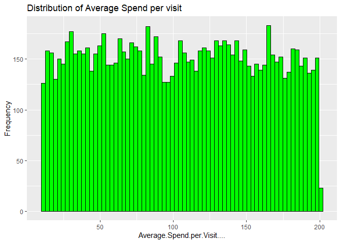

FA6_AFUNDAR_EDA
================
Audrie Lex L. Afundar
2025-05-02

``` r
cust_data<-read.csv("D:/Download folder/customer_segmentation.csv")

head(cust_data)
```

    ##   Customer.ID Age Annual.Income..K.. Gender Product.Category.Purchased
    ## 1           1  56                106 Female                    Fashion
    ## 2           2  69                 66 Female                       Home
    ## 3           3  46                110   Male                    Fashion
    ## 4           4  32                 50   Male                Electronics
    ## 5           5  60                 73 Female                     Others
    ## 6           6  25                 48   Male                       Home
    ##   Average.Spend.per.Visit.... Number.of.Visits.in.Last.6.Months
    ## 1                    163.4528                                16
    ## 2                    163.0205                                31
    ## 3                    104.5413                                29
    ## 4                    110.0646                                26
    ## 5                    142.2546                                38
    ## 6                    106.7621                                22
    ##   Customer.Segment
    ## 1  Premium Shopper
    ## 2   Budget Shopper
    ## 3   Budget Shopper
    ## 4  Regular Shopper
    ## 5  Regular Shopper
    ## 6   Budget Shopper

## Data Exploration

Visualize the distribution of Age, Annual Income, and Average Spend per
Visit.

``` r
ggplot(cust_data, aes(x=Age))+
  geom_histogram(fill="green", color="black", bins=50)+
  labs(title = "Distribution of Age", x = "Age", y = "Frequency")
```

<!-- -->

``` r
ggplot(cust_data, aes(x=Annual.Income..K..))+
  geom_histogram(fill="green", color="black", bins=100)+
  labs(title = "Distribution of Annual Income", x = "Annual.Income..K..", y = "Frequency")
```

<!-- -->

``` r
ggplot(cust_data, aes(x=Average.Spend.per.Visit....))+
  geom_histogram(fill="green", color="black", bins=70)+
  labs(title = "Distribution of Average Spend per visit", x = "Average.Spend.per.Visit....", y = "Frequency")
```

<!-- -->

``` r
colSums(is.na(cust_data))
```

    ##                       Customer.ID                               Age 
    ##                                 0                                 0 
    ##                Annual.Income..K..                            Gender 
    ##                                 0                                 0 
    ##        Product.Category.Purchased       Average.Spend.per.Visit.... 
    ##                                 0                                 0 
    ## Number.of.Visits.in.Last.6.Months                  Customer.Segment 
    ##                                 0                                 0

There are no missing values for all the columns, thus there are no need
to imputate.

``` r
str(cust_data)
```

    ## 'data.frame':    10532 obs. of  8 variables:
    ##  $ Customer.ID                      : int  1 2 3 4 5 6 7 8 9 10 ...
    ##  $ Age                              : int  56 69 46 32 60 25 38 56 36 40 ...
    ##  $ Annual.Income..K..               : int  106 66 110 50 73 48 100 131 37 106 ...
    ##  $ Gender                           : chr  "Female" "Female" "Male" "Male" ...
    ##  $ Product.Category.Purchased       : chr  "Fashion" "Home" "Fashion" "Electronics" ...
    ##  $ Average.Spend.per.Visit....      : num  163 163 105 110 142 ...
    ##  $ Number.of.Visits.in.Last.6.Months: int  16 31 29 26 38 22 20 33 34 34 ...
    ##  $ Customer.Segment                 : chr  "Premium Shopper" "Budget Shopper" "Budget Shopper" "Regular Shopper" ...

``` r
ggplot(cust_data, aes(x=Customer.Segment))+
  geom_bar(fill="green", color="black")+
  labs(title = "Distribution of Customer Segments", x = "Customer.Segment", y = "Frequency")
```

<!-- -->

``` r
budget_shopper=sum(cust_data$Customer.Segment == "Budget Shopper")
prem_shopper=sum(cust_data$Customer.Segment == "Premium Shopper")
reg_shopper=sum(cust_data$Customer.Segment == "Regular Shopper")

cat("Budget Shopper: ", budget_shopper, "\n")
```

    ## Budget Shopper:  3516

``` r
cat("Premium Shopper: ", prem_shopper, "\n")
```

    ## Premium Shopper:  3483

``` r
cat("Regular Shopper: ", reg_shopper, "\n")
```

    ## Regular Shopper:  3533

The distribution of the types of shoppers are generally the same as also
seen in the sum of the total shoppers with highest being 3533 regular
shoppers closely followed by budget shoppers with 3516 and lastly, 3483
premium shoppers.

``` r
ggplot(cust_data, aes(x=Product.Category.Purchased))+
  geom_bar(fill="green", color="black")+
  labs(title = "Distribution of Product Purchased", x = "Product.Category.Purchased", y = "Frequency")
```

<!-- -->

## Data Preprocessing

``` r
cust_data$Gender <- ifelse(cust_data$Gender == "Male", 1, 0)

head(cust_data)
```

    ##   Customer.ID Age Annual.Income..K.. Gender Product.Category.Purchased
    ## 1           1  56                106      0                    Fashion
    ## 2           2  69                 66      0                       Home
    ## 3           3  46                110      1                    Fashion
    ## 4           4  32                 50      1                Electronics
    ## 5           5  60                 73      0                     Others
    ## 6           6  25                 48      1                       Home
    ##   Average.Spend.per.Visit.... Number.of.Visits.in.Last.6.Months
    ## 1                    163.4528                                16
    ## 2                    163.0205                                31
    ## 3                    104.5413                                29
    ## 4                    110.0646                                26
    ## 5                    142.2546                                38
    ## 6                    106.7621                                22
    ##   Customer.Segment
    ## 1  Premium Shopper
    ## 2   Budget Shopper
    ## 3   Budget Shopper
    ## 4  Regular Shopper
    ## 5  Regular Shopper
    ## 6   Budget Shopper

``` r
product_dummies <- model.matrix(~ `Product.Category.Purchased` - 1, data = cust_data)

cust_data <- cbind(cust_data[, !names(cust_data) %in% "Product.Category.Purchased"], product_dummies)

head(cust_data)
```

    ##   Customer.ID Age Annual.Income..K.. Gender Average.Spend.per.Visit....
    ## 1           1  56                106      0                    163.4528
    ## 2           2  69                 66      0                    163.0205
    ## 3           3  46                110      1                    104.5413
    ## 4           4  32                 50      1                    110.0646
    ## 5           5  60                 73      0                    142.2546
    ## 6           6  25                 48      1                    106.7621
    ##   Number.of.Visits.in.Last.6.Months Customer.Segment
    ## 1                                16  Premium Shopper
    ## 2                                31   Budget Shopper
    ## 3                                29   Budget Shopper
    ## 4                                26  Regular Shopper
    ## 5                                38  Regular Shopper
    ## 6                                22   Budget Shopper
    ##   Product.Category.PurchasedBooks Product.Category.PurchasedElectronics
    ## 1                               0                                     0
    ## 2                               0                                     0
    ## 3                               0                                     0
    ## 4                               0                                     1
    ## 5                               0                                     0
    ## 6                               0                                     0
    ##   Product.Category.PurchasedFashion Product.Category.PurchasedHome
    ## 1                                 1                              0
    ## 2                                 0                              1
    ## 3                                 1                              0
    ## 4                                 0                              0
    ## 5                                 0                              0
    ## 6                                 0                              1
    ##   Product.Category.PurchasedOthers
    ## 1                                0
    ## 2                                0
    ## 3                                0
    ## 4                                0
    ## 5                                1
    ## 6                                0

Scaling

``` r
scale_cust<-cust_data

scale_cust[, c("Age", "Annual.Income..K..", "Average.Spend.per.Visit....")] <- 
  scale(scale_cust[, c("Age", "Annual.Income..K..", "Average.Spend.per.Visit....")])

head(scale_cust)
```

    ##   Customer.ID        Age Annual.Income..K.. Gender Average.Spend.per.Visit....
    ## 1           1  0.8323972          0.4886923      0                 1.083217431
    ## 2           2  1.7046295         -0.6737348      0                 1.075302088
    ## 3           3  0.1614492          0.6049350      1                 0.004477697
    ## 4           4 -0.7778779         -1.1387056      1                 0.105615627
    ## 5           5  1.1007764         -0.4703100      0                 0.695052913
    ## 6           6 -1.2475415         -1.1968270      1                 0.045143784
    ##   Number.of.Visits.in.Last.6.Months Customer.Segment
    ## 1                                16  Premium Shopper
    ## 2                                31   Budget Shopper
    ## 3                                29   Budget Shopper
    ## 4                                26  Regular Shopper
    ## 5                                38  Regular Shopper
    ## 6                                22   Budget Shopper
    ##   Product.Category.PurchasedBooks Product.Category.PurchasedElectronics
    ## 1                               0                                     0
    ## 2                               0                                     0
    ## 3                               0                                     0
    ## 4                               0                                     1
    ## 5                               0                                     0
    ## 6                               0                                     0
    ##   Product.Category.PurchasedFashion Product.Category.PurchasedHome
    ## 1                                 1                              0
    ## 2                                 0                              1
    ## 3                                 1                              0
    ## 4                                 0                              0
    ## 5                                 0                              0
    ## 6                                 0                              1
    ##   Product.Category.PurchasedOthers
    ## 1                                0
    ## 2                                0
    ## 3                                0
    ## 4                                0
    ## 5                                1
    ## 6                                0

``` r
set.seed(421)

split <- initial_split(scale_cust, prop = 0.8, strata = "Customer.Segment")


cust_train <- training(split)
cust_test <- testing(split)
```

## Model Building

Multi nomial logistic regression without regularization.

``` r
multi_model_cust<- multinom(Customer.Segment ~ .-Customer.ID, data=cust_train)
```

    ## # weights:  36 (22 variable)
    ## initial  value 9254.709920 
    ## iter  10 value 9242.954601
    ## iter  20 value 9241.365500
    ## final  value 9241.000766 
    ## converged

``` r
summary(multi_model_cust)
```

    ## Call:
    ## multinom(formula = Customer.Segment ~ . - Customer.ID, data = cust_train)
    ## 
    ## Coefficients:
    ##                 (Intercept)          Age Annual.Income..K..      Gender
    ## Premium Shopper  0.08044403 -0.002793427        -0.01415738 -0.03739048
    ## Regular Shopper  0.11641180  0.024445814        -0.02200633 -0.10775769
    ##                 Average.Spend.per.Visit.... Number.of.Visits.in.Last.6.Months
    ## Premium Shopper                 -0.02620291                      -0.003778490
    ## Regular Shopper                 -0.05896036                      -0.003540657
    ##                 Product.Category.PurchasedBooks
    ## Premium Shopper                      -0.1182501
    ## Regular Shopper                      -0.1119674
    ##                 Product.Category.PurchasedElectronics
    ## Premium Shopper                            0.04269354
    ## Regular Shopper                            0.02820003
    ##                 Product.Category.PurchasedFashion
    ## Premium Shopper                         0.1467802
    ## Regular Shopper                         0.1573647
    ##                 Product.Category.PurchasedHome Product.Category.PurchasedOthers
    ## Premium Shopper                   -0.010700271                       0.01992059
    ## Regular Shopper                   -0.007144119                       0.04995863
    ## 
    ## Std. Errors:
    ##                 (Intercept)        Age Annual.Income..K..     Gender
    ## Premium Shopper  0.05828735 0.02676351         0.02675384 0.05354535
    ## Regular Shopper  0.05798971 0.02668117         0.02667527 0.05338278
    ##                 Average.Spend.per.Visit.... Number.of.Visits.in.Last.6.Months
    ## Premium Shopper                  0.02676280                       0.002653536
    ## Regular Shopper                  0.02668685                       0.002645226
    ##                 Product.Category.PurchasedBooks
    ## Premium Shopper                      0.05380344
    ## Regular Shopper                      0.05360362
    ##                 Product.Category.PurchasedElectronics
    ## Premium Shopper                            0.05544172
    ## Regular Shopper                            0.05552856
    ##                 Product.Category.PurchasedFashion
    ## Premium Shopper                        0.05677689
    ## Regular Shopper                        0.05659137
    ##                 Product.Category.PurchasedHome Product.Category.PurchasedOthers
    ## Premium Shopper                     0.05496446                       0.05327723
    ## Regular Shopper                     0.05484648                       0.05288566
    ## 
    ## Residual Deviance: 18482 
    ## AIC: 18522

Predict the test set.

``` r
test_pred_cust<-predict(multi_model_cust, newdata=cust_test, type="class")
```

Use appropriate regularization. I’ll be using the multinomial from
glmnet. Together with this, I’ll be tuning the lambda using cross
validation to get the best lambda for the model.

``` r
x<-model.matrix(Customer.Segment ~ .-Customer.ID , data=cust_train)
y<-as.factor(cust_train$Customer.Segment)
```

``` r
cross_v_cust<-cv.glmnet(x,y, family="multinomial", type.measure="class", alpha=0)

lambda_b<-cross_v_cust$lambda.min
```

Model with the best lambda

``` r
multi_model_cust_lambda<-glmnet(x,y , family="multinomial", lambda=lambda_b, alpha=0)

coef(multi_model_cust_lambda, s=lambda_b)
```

    ## $`Budget Shopper`
    ## 12 x 1 sparse Matrix of class "dgCMatrix"
    ##                                                   1
    ## (Intercept)                           -9.567485e-04
    ## (Intercept)                            .           
    ## Age                                   -2.028658e-04
    ## Annual.Income..K..                     3.334089e-04
    ## Gender                                 1.448313e-03
    ## Average.Spend.per.Visit....            9.224210e-04
    ## Number.of.Visits.in.Last.6.Months      7.553352e-05
    ## Product.Category.PurchasedBooks        3.457888e-03
    ## Product.Category.PurchasedElectronics -4.626476e-04
    ## Product.Category.PurchasedFashion     -3.403849e-03
    ## Product.Category.PurchasedHome         7.178862e-04
    ## Product.Category.PurchasedOthers      -4.978457e-04
    ## 
    ## $`Premium Shopper`
    ## 12 x 1 sparse Matrix of class "dgCMatrix"
    ##                                                   1
    ## (Intercept)                           -7.129923e-03
    ## (Intercept)                            .           
    ## Age                                   -3.258288e-04
    ## Annual.Income..K..                    -3.604569e-05
    ## Gender                                 4.045002e-04
    ## Average.Spend.per.Visit....            6.462854e-05
    ## Number.of.Visits.in.Last.6.Months     -4.173436e-05
    ## Product.Category.PurchasedBooks       -1.755932e-03
    ## Product.Category.PurchasedElectronics  6.877787e-04
    ## Product.Category.PurchasedFashion      1.648102e-03
    ## Product.Category.PurchasedHome        -2.565524e-04
    ## Product.Category.PurchasedOthers      -1.946996e-04
    ## 
    ## $`Regular Shopper`
    ## 12 x 1 sparse Matrix of class "dgCMatrix"
    ##                                                   1
    ## (Intercept)                            8.086672e-03
    ## (Intercept)                            .           
    ## Age                                    5.286946e-04
    ## Annual.Income..K..                    -2.973632e-04
    ## Gender                                -1.852813e-03
    ## Average.Spend.per.Visit....           -9.870496e-04
    ## Number.of.Visits.in.Last.6.Months     -3.379915e-05
    ## Product.Category.PurchasedBooks       -1.701957e-03
    ## Product.Category.PurchasedElectronics -2.251312e-04
    ## Product.Category.PurchasedFashion      1.755746e-03
    ## Product.Category.PurchasedHome        -4.613338e-04
    ## Product.Category.PurchasedOthers       6.925453e-04

``` r
plot(cross_v_cust)
```

<!-- -->
Predicting with the cust_test along with the best lambda

``` r
x_test<-model.matrix(Customer.Segment ~.-Customer.ID , data=cust_test)

test_pred_cust_lambda<-predict(multi_model_cust_lambda, newx=x_test, type="class")
```

## Model Evaluation

Evaluating both models

``` r
multi_perf<-confusionMatrix(factor(test_pred_cust), factor(cust_test$Customer.Segment))

multi_perf
```

    ## Confusion Matrix and Statistics
    ## 
    ##                  Reference
    ## Prediction        Budget Shopper Premium Shopper Regular Shopper
    ##   Budget Shopper             286             271             304
    ##   Premium Shopper            110             103              95
    ##   Regular Shopper            308             323             308
    ## 
    ## Overall Statistics
    ##                                           
    ##                Accuracy : 0.3306          
    ##                  95% CI : (0.3106, 0.3512)
    ##     No Information Rate : 0.3354          
    ##     P-Value [Acc > NIR] : 0.6853          
    ##                                           
    ##                   Kappa : -0.0052         
    ##                                           
    ##  Mcnemar's Test P-Value : <2e-16          
    ## 
    ## Statistics by Class:
    ## 
    ##                      Class: Budget Shopper Class: Premium Shopper
    ## Sensitivity                         0.4062                0.14778
    ## Specificity                         0.5905                0.85471
    ## Pos Pred Value                      0.3322                0.33442
    ## Neg Pred Value                      0.6648                0.67000
    ## Prevalence                          0.3340                0.33065
    ## Detection Rate                      0.1357                0.04886
    ## Detection Prevalence                0.4084                0.14611
    ## Balanced Accuracy                   0.4984                0.50124
    ##                      Class: Regular Shopper
    ## Sensitivity                          0.4356
    ## Specificity                          0.5496
    ## Pos Pred Value                       0.3280
    ## Neg Pred Value                       0.6587
    ## Prevalence                           0.3354
    ## Detection Rate                       0.1461
    ## Detection Prevalence                 0.4454
    ## Balanced Accuracy                    0.4926

``` r
accuracy <- multi_perf$overall["Accuracy"]

precision <- multi_perf$byClass["Pos Pred Value"]

recall <- multi_perf$byClass["Sensitivity"]

f1_score <- 2 * (precision * recall) / (precision + recall)


cat("Model Performance Metrics:\n")
```

    ## Model Performance Metrics:

``` r
cat("Accuracy: ", round(accuracy, 4), "\n")
```

    ## Accuracy:  0.3306

``` r
cat("Precision: ", round(precision, 4), "\n")
```

    ## Precision:  NA

``` r
cat("Recall: ", round(recall, 4), "\n")
```

    ## Recall:  NA

``` r
cat("F1-Score: ", round(f1_score, 4), "\n")
```

    ## F1-Score:  NA

``` r
multi_perf_lam<-confusionMatrix(factor(test_pred_cust_lambda), factor(cust_test$Customer.Segment))
```

    ## Warning in levels(reference) != levels(data): longer object length is not a
    ## multiple of shorter object length

    ## Warning in confusionMatrix.default(factor(test_pred_cust_lambda),
    ## factor(cust_test$Customer.Segment)): Levels are not in the same order for
    ## reference and data. Refactoring data to match.

``` r
multi_perf_lam
```

    ## Confusion Matrix and Statistics
    ## 
    ##                  Reference
    ## Prediction        Budget Shopper Premium Shopper Regular Shopper
    ##   Budget Shopper              87              81             101
    ##   Premium Shopper              0               0               0
    ##   Regular Shopper            617             616             606
    ## 
    ## Overall Statistics
    ##                                           
    ##                Accuracy : 0.3287          
    ##                  95% CI : (0.3087, 0.3493)
    ##     No Information Rate : 0.3354          
    ##     P-Value [Acc > NIR] : 0.7478          
    ##                                           
    ##                   Kappa : -0.0097         
    ##                                           
    ##  Mcnemar's Test P-Value : <2e-16          
    ## 
    ## Statistics by Class:
    ## 
    ##                      Class: Budget Shopper Class: Premium Shopper
    ## Sensitivity                        0.12358                 0.0000
    ## Specificity                        0.87037                 1.0000
    ## Pos Pred Value                     0.32342                    NaN
    ## Neg Pred Value                     0.66449                 0.6694
    ## Prevalence                         0.33397                 0.3306
    ## Detection Rate                     0.04127                 0.0000
    ## Detection Prevalence               0.12761                 0.0000
    ## Balanced Accuracy                  0.49697                 0.5000
    ##                      Class: Regular Shopper
    ## Sensitivity                          0.8571
    ## Specificity                          0.1199
    ## Pos Pred Value                       0.3295
    ## Neg Pred Value                       0.6245
    ## Prevalence                           0.3354
    ## Detection Rate                       0.2875
    ## Detection Prevalence                 0.8724
    ## Balanced Accuracy                    0.4885

``` r
accuracy <- multi_perf_lam$overall["Accuracy"]

precision <- multi_perf_lam$byClass["Pos Pred Value"]

recall <- multi_perf_lam$byClass["Sensitivity"]

f1_score <- 2 * (precision * recall) / (precision + recall)


cat("Model Performance Metrics:\n")
```

    ## Model Performance Metrics:

``` r
cat("Accuracy: ", round(accuracy, 4), "\n")
```

    ## Accuracy:  0.3287

``` r
cat("Precision: ", round(precision, 4), "\n")
```

    ## Precision:  NA

``` r
cat("Recall: ", round(recall, 4), "\n")
```

    ## Recall:  NA

``` r
cat("F1-Score: ", round(f1_score, 4), "\n")
```

    ## F1-Score:  NA

There are no precision, recall and F1-Score. This is due to the fact
that there are no predicted premium shopper.

Visualizing the confusion matrix

``` r
cm_df <- as.data.frame(multi_perf_lam$table)
colnames(cm_df) <- c("Predicted", "Actual", "Freq")

ggplot(data = cm_df, aes(x = Actual, y = Predicted, fill = Freq)) +
  geom_tile(color = "white") +
  geom_text(aes(label = Freq), vjust = 1) +
  labs(title = "Confusion Matrix Heatmap", x = "Actual", y = "Predicted") +
  theme_minimal()
```

<!-- -->

\*\*Budget Shopper:

Correctly predicted: 87

Premium shopper but was tagged as budget: 81

Regular shopper but was tagged as budget: 101

\*\*Premium Shopper:

Never predicted by the model with the best lambda

\*\*Regular Shopper:

Budget shopper but was tagged as regular: 617

Premium shopper but was tagged as regular: 616

Correctly predicted: 606

## Refinement

``` r
cust_train$Income_Age <- cust_train$Annual.Income..K.. * cust_train$Age
cust_test$Income_Age <- cust_test$Annual.Income..K.. * cust_test$Age

x_w<-model.matrix(Customer.Segment ~ .-Customer.ID , data=cust_train)[,-1]

y_w<-as.factor(cust_train$Customer.Segment)
x_test_w<-model.matrix(Customer.Segment ~.-Customer.ID , data=cust_test)[,-1]
```

``` r
cross_v_cust_w<-cv.glmnet(x_w,y_w, family="multinomial", type.measure="class", alpha=0)

lambda_b_w<-cross_v_cust_w$lambda.min
```

``` r
multi_model_cust_lambda_w<-glmnet(x_w,y_w , family="multinomial", lambda=lambda_b_w, alpha=0)

coef(multi_model_cust_lambda_w, s=lambda_b_w)
```

    ## $`Budget Shopper`
    ## 12 x 1 sparse Matrix of class "dgCMatrix"
    ##                                                   1
    ## (Intercept)                           -9.564456e-04
    ## Age                                   -2.028587e-04
    ## Annual.Income..K..                     3.334145e-04
    ## Gender                                 1.448302e-03
    ## Average.Spend.per.Visit....            9.224274e-04
    ## Number.of.Visits.in.Last.6.Months      7.553292e-05
    ## Product.Category.PurchasedBooks        3.457906e-03
    ## Product.Category.PurchasedElectronics -4.626586e-04
    ## Product.Category.PurchasedFashion     -3.403813e-03
    ## Product.Category.PurchasedHome         7.179255e-04
    ## Product.Category.PurchasedOthers      -4.979210e-04
    ## Income_Age                             4.296415e-05
    ## 
    ## $`Premium Shopper`
    ## 12 x 1 sparse Matrix of class "dgCMatrix"
    ##                                                   1
    ## (Intercept)                           -7.131700e-03
    ## Age                                   -3.258785e-04
    ## Annual.Income..K..                    -3.606654e-05
    ## Gender                                 4.045674e-04
    ## Average.Spend.per.Visit....            6.458913e-05
    ## Number.of.Visits.in.Last.6.Months     -4.173070e-05
    ## Product.Category.PurchasedBooks       -1.756042e-03
    ## Product.Category.PurchasedElectronics  6.878480e-04
    ## Product.Category.PurchasedFashion      1.647881e-03
    ## Product.Category.PurchasedHome        -2.567899e-04
    ## Product.Category.PurchasedOthers      -1.942366e-04
    ## Income_Age                            -2.685296e-04
    ## 
    ## $`Regular Shopper`
    ## 12 x 1 sparse Matrix of class "dgCMatrix"
    ##                                                   1
    ## (Intercept)                            8.088146e-03
    ## Age                                    5.287372e-04
    ## Annual.Income..K..                    -2.973480e-04
    ## Gender                                -1.852869e-03
    ## Average.Spend.per.Visit....           -9.870165e-04
    ## Number.of.Visits.in.Last.6.Months     -3.380222e-05
    ## Product.Category.PurchasedBooks       -1.701864e-03
    ## Product.Category.PurchasedElectronics -2.251894e-04
    ## Product.Category.PurchasedFashion      1.755931e-03
    ## Product.Category.PurchasedHome        -4.611356e-04
    ## Product.Category.PurchasedOthers       6.921577e-04
    ## Income_Age                             2.255655e-04

``` r
test_pred_cust_lambda_w<-predict(multi_model_cust_lambda_w, newx=x_test_w, type="class")
```

``` r
length(test_pred_cust_lambda_w)
```

    ## [1] 2108

``` r
length(cust_test$Customer.Segment)
```

    ## [1] 2108

``` r
  multi_perf_lam_w<-confusionMatrix(factor(test_pred_cust_lambda_w), factor(cust_test$Customer.Segment))
```

    ## Warning in levels(reference) != levels(data): longer object length is not a
    ## multiple of shorter object length

    ## Warning in confusionMatrix.default(factor(test_pred_cust_lambda_w),
    ## factor(cust_test$Customer.Segment)): Levels are not in the same order for
    ## reference and data. Refactoring data to match.

``` r
  multi_perf_lam_w
```

    ## Confusion Matrix and Statistics
    ## 
    ##                  Reference
    ## Prediction        Budget Shopper Premium Shopper Regular Shopper
    ##   Budget Shopper              88              80             107
    ##   Premium Shopper              0               0               0
    ##   Regular Shopper            616             617             600
    ## 
    ## Overall Statistics
    ##                                           
    ##                Accuracy : 0.3264          
    ##                  95% CI : (0.3064, 0.3469)
    ##     No Information Rate : 0.3354          
    ##     P-Value [Acc > NIR] : 0.8157          
    ##                                           
    ##                   Kappa : -0.0133         
    ##                                           
    ##  Mcnemar's Test P-Value : <2e-16          
    ## 
    ## Statistics by Class:
    ## 
    ##                      Class: Budget Shopper Class: Premium Shopper
    ## Sensitivity                        0.12500                 0.0000
    ## Specificity                        0.86681                 1.0000
    ## Pos Pred Value                     0.32000                    NaN
    ## Neg Pred Value                     0.66394                 0.6694
    ## Prevalence                         0.33397                 0.3306
    ## Detection Rate                     0.04175                 0.0000
    ## Detection Prevalence               0.13046                 0.0000
    ## Balanced Accuracy                  0.49590                 0.5000
    ##                      Class: Regular Shopper
    ## Sensitivity                          0.8487
    ## Specificity                          0.1199
    ## Pos Pred Value                       0.3273
    ## Neg Pred Value                       0.6109
    ## Prevalence                           0.3354
    ## Detection Rate                       0.2846
    ## Detection Prevalence                 0.8695
    ## Balanced Accuracy                    0.4843

``` r
  accuracy <- multi_perf_lam_w$overall["Accuracy"]
  
  precision <- multi_perf_lam_w$byClass["Pos Pred Value"]
  
  recall <- multi_perf_lam_w$byClass["Sensitivity"]
  
  f1_score <- 2 * (precision * recall) / (precision + recall)
  

  
  cat("Model Performance Metrics:\n")
```

    ## Model Performance Metrics:

``` r
  cat("Accuracy: ", round(accuracy, 4), "\n")
```

    ## Accuracy:  0.3264

``` r
  cat("Precision: ", round(precision, 4), "\n")
```

    ## Precision:  NA

``` r
  cat("Recall: ", round(recall, 4), "\n")
```

    ## Recall:  NA

``` r
  cat("F1-Score: ", round(f1_score, 4), "\n")
```

    ## F1-Score:  NA

``` r
multi_model_cust_try<- multinom(Customer.Segment ~ ., data=cust_train)
```

    ## # weights:  42 (26 variable)
    ## initial  value 9254.709920 
    ## iter  10 value 9242.548542
    ## iter  20 value 9240.866960
    ## final  value 9240.750015 
    ## converged

``` r
test_pred_cust_try<-predict(multi_model_cust_try, newdata=cust_test, type="class")
```

``` r
multi_perf_try<-confusionMatrix(factor(test_pred_cust_try), factor(cust_test$Customer.Segment))

multi_perf_try
```

    ## Confusion Matrix and Statistics
    ## 
    ##                  Reference
    ## Prediction        Budget Shopper Premium Shopper Regular Shopper
    ##   Budget Shopper             285             274             300
    ##   Premium Shopper             97             102              89
    ##   Regular Shopper            322             321             318
    ## 
    ## Overall Statistics
    ##                                          
    ##                Accuracy : 0.3344         
    ##                  95% CI : (0.3143, 0.355)
    ##     No Information Rate : 0.3354         
    ##     P-Value [Acc > NIR] : 0.5449         
    ##                                          
    ##                   Kappa : 4e-04          
    ##                                          
    ##  Mcnemar's Test P-Value : <2e-16         
    ## 
    ## Statistics by Class:
    ## 
    ##                      Class: Budget Shopper Class: Premium Shopper
    ## Sensitivity                         0.4048                0.14634
    ## Specificity                         0.5912                0.86818
    ## Pos Pred Value                      0.3318                0.35417
    ## Neg Pred Value                      0.6645                0.67308
    ## Prevalence                          0.3340                0.33065
    ## Detection Rate                      0.1352                0.04839
    ## Detection Prevalence                0.4075                0.13662
    ## Balanced Accuracy                   0.4980                0.50726
    ##                      Class: Regular Shopper
    ## Sensitivity                          0.4498
    ## Specificity                          0.5410
    ## Pos Pred Value                       0.3309
    ## Neg Pred Value                       0.6609
    ## Prevalence                           0.3354
    ## Detection Rate                       0.1509
    ## Detection Prevalence                 0.4559
    ## Balanced Accuracy                    0.4954

``` r
accuracy <- multi_perf_try$overall["Accuracy"]

precision <- multi_perf_try$byClass["Pos Pred Value"]

recall <- multi_perf_try$byClass["Sensitivity"]

f1_score <- 2 * (precision * recall) / (precision + recall)


cat("Model Performance Metrics:\n")
```

    ## Model Performance Metrics:

``` r
cat("Accuracy: ", round(accuracy, 4), "\n")
```

    ## Accuracy:  0.3344

``` r
cat("Precision: ", round(precision, 4), "\n")
```

    ## Precision:  NA

``` r
cat("Recall: ", round(recall, 4), "\n")
```

    ## Recall:  NA

``` r
cat("F1-Score: ", round(f1_score, 4), "\n")
```

    ## F1-Score:  NA

## Grid search hyperparameter tuning

``` r
train_control <- trainControl(method = "cv", number = 5)
grid <- expand.grid(mtry = c(2,4,6))


model <- train(Customer.Segment ~. -Product.Category.PurchasedOthers 
                     -Product.Category.PurchasedHome 
                     -Product.Category.PurchasedElectronics 
                     -Product.Category.PurchasedFashion-Product.Category.PurchasedBooks-Gender-Customer.ID, data = cust_train, trControl = train_control, method = "rf", tuneGrid = grid)
```

    ## Warning in randomForest.default(x, y, mtry = param$mtry, ...): invalid mtry:
    ## reset to within valid range
    ## Warning in randomForest.default(x, y, mtry = param$mtry, ...): invalid mtry:
    ## reset to within valid range
    ## Warning in randomForest.default(x, y, mtry = param$mtry, ...): invalid mtry:
    ## reset to within valid range
    ## Warning in randomForest.default(x, y, mtry = param$mtry, ...): invalid mtry:
    ## reset to within valid range
    ## Warning in randomForest.default(x, y, mtry = param$mtry, ...): invalid mtry:
    ## reset to within valid range

``` r
model$bestTune
```

    ##   mtry
    ## 1    2

``` r
print(model)
```

    ## Random Forest 
    ## 
    ## 8424 samples
    ##   12 predictor
    ##    3 classes: 'Budget Shopper', 'Premium Shopper', 'Regular Shopper' 
    ## 
    ## No pre-processing
    ## Resampling: Cross-Validated (5 fold) 
    ## Summary of sample sizes: 6738, 6740, 6739, 6740, 6739 
    ## Resampling results across tuning parameters:
    ## 
    ##   mtry  Accuracy   Kappa      
    ##   2     0.3412887  0.011883387
    ##   4     0.3365391  0.004762835
    ##   6     0.3344010  0.001568158
    ## 
    ## Accuracy was used to select the optimal model using the largest value.
    ## The final value used for the model was mtry = 2.

``` r
plot(model)
```

<!-- -->

``` r
preds <- predict(model, newdata = cust_test)
```

``` r
length(preds)
```

    ## [1] 2108

``` r
length(cust_test$Customer.Segment)
```

    ## [1] 2108

``` r
confusionMatrix(factor(preds), factor(cust_test$Customer.Segment))
```

    ## Confusion Matrix and Statistics
    ## 
    ##                  Reference
    ## Prediction        Budget Shopper Premium Shopper Regular Shopper
    ##   Budget Shopper             222             233             234
    ##   Premium Shopper            252             223             241
    ##   Regular Shopper            230             241             232
    ## 
    ## Overall Statistics
    ##                                           
    ##                Accuracy : 0.3212          
    ##                  95% CI : (0.3012, 0.3416)
    ##     No Information Rate : 0.3354          
    ##     P-Value [Acc > NIR] : 0.9207          
    ##                                           
    ##                   Kappa : -0.0182         
    ##                                           
    ##  Mcnemar's Test P-Value : 0.8545          
    ## 
    ## Statistics by Class:
    ## 
    ##                      Class: Budget Shopper Class: Premium Shopper
    ## Sensitivity                         0.3153                 0.3199
    ## Specificity                         0.6674                 0.6506
    ## Pos Pred Value                      0.3222                 0.3115
    ## Neg Pred Value                      0.6603                 0.6595
    ## Prevalence                          0.3340                 0.3306
    ## Detection Rate                      0.1053                 0.1058
    ## Detection Prevalence                0.3269                 0.3397
    ## Balanced Accuracy                   0.4914                 0.4853
    ##                      Class: Regular Shopper
    ## Sensitivity                          0.3281
    ## Specificity                          0.6638
    ## Pos Pred Value                       0.3300
    ## Neg Pred Value                       0.6619
    ## Prevalence                           0.3354
    ## Detection Rate                       0.1101
    ## Detection Prevalence                 0.3335
    ## Balanced Accuracy                    0.4960

## Random search hyperparameter tuning

``` r
train_control_rando <- trainControl(method = "cv", number = 5, search = "random")

model_rando <- train(Customer.Segment ~.-Customer.ID, data = cust_train, trControl = train_control_rando, method = "rf", tuneLength=5)
```

``` r
model_rando$bestTune
```

    ##   mtry
    ## 4    7

``` r
print(model_rando)
```

    ## Random Forest 
    ## 
    ## 8424 samples
    ##   12 predictor
    ##    3 classes: 'Budget Shopper', 'Premium Shopper', 'Regular Shopper' 
    ## 
    ## No pre-processing
    ## Resampling: Cross-Validated (5 fold) 
    ## Summary of sample sizes: 6739, 6739, 6740, 6739, 6739 
    ## Resampling results across tuning parameters:
    ## 
    ##   mtry  Accuracy   Kappa      
    ##   3     0.3402160  0.010190481
    ##   5     0.3391482  0.008636690
    ##   6     0.3387921  0.008094504
    ##   7     0.3441346  0.016137751
    ## 
    ## Accuracy was used to select the optimal model using the largest value.
    ## The final value used for the model was mtry = 7.

``` r
preds_rando <- predict(model_rando, newdata = cust_test)


confusionMatrix(factor(preds_rando), factor(cust_test$Customer.Segment))
```

    ## Confusion Matrix and Statistics
    ## 
    ##                  Reference
    ## Prediction        Budget Shopper Premium Shopper Regular Shopper
    ##   Budget Shopper             225             232             243
    ##   Premium Shopper            246             221             223
    ##   Regular Shopper            233             244             241
    ## 
    ## Overall Statistics
    ##                                           
    ##                Accuracy : 0.3259          
    ##                  95% CI : (0.3059, 0.3464)
    ##     No Information Rate : 0.3354          
    ##     P-Value [Acc > NIR] : 0.8278          
    ##                                           
    ##                   Kappa : -0.0112         
    ##                                           
    ##  Mcnemar's Test P-Value : 0.6675          
    ## 
    ## Statistics by Class:
    ## 
    ##                      Class: Budget Shopper Class: Premium Shopper
    ## Sensitivity                         0.3196                 0.3171
    ## Specificity                         0.6617                 0.6676
    ## Pos Pred Value                      0.3214                 0.3203
    ## Neg Pred Value                      0.6598                 0.6643
    ## Prevalence                          0.3340                 0.3306
    ## Detection Rate                      0.1067                 0.1048
    ## Detection Prevalence                0.3321                 0.3273
    ## Balanced Accuracy                   0.4906                 0.4923
    ##                      Class: Regular Shopper
    ## Sensitivity                          0.3409
    ## Specificity                          0.6595
    ## Pos Pred Value                       0.3357
    ## Neg Pred Value                       0.6647
    ## Prevalence                           0.3354
    ## Detection Rate                       0.1143
    ## Detection Prevalence                 0.3406
    ## Balanced Accuracy                    0.5002

``` r
varImp(model_rando)
```

    ## rf variable importance
    ## 
    ##                                         Overall
    ## Average.Spend.per.Visit....           100.00000
    ## Income_Age                             85.15124
    ## Annual.Income..K..                     70.53705
    ## Number.of.Visits.in.Last.6.Months      65.36171
    ## Age                                    57.53838
    ## Gender                                  5.93057
    ## Product.Category.PurchasedOthers        2.07620
    ## Product.Category.PurchasedElectronics   1.71084
    ## Product.Category.PurchasedHome          1.67471
    ## Product.Category.PurchasedBooks         0.05177
    ## Product.Category.PurchasedFashion       0.00000

``` r
varImp(model)
```

    ## rf variable importance
    ## 
    ##                                   Overall
    ## Average.Spend.per.Visit....        100.00
    ## Income_Age                          73.49
    ## Annual.Income..K..                  33.32
    ## Number.of.Visits.in.Last.6.Months   16.83
    ## Age                                  0.00

With both the hyperparameter tuning, the highest accuracy we got is
approximately 34.5% which is not ideal.

## Summary

The model was built two ways (before hyperparameter tuning using grid
search and random search), one with regularization and one without. The
features used were all the columns including the hot encoded ones except
the customer id since this might negatively affect the models
themselves.

Approximately 32-33% was seen in these models, which is not ideal for a
model.

With that, we used hyperparameter tuning, both grid search and random
search to further improve the model. As seen on the training model, the
highest accuracy we got using these tuning was approximately 34.5% which
was an improvement nonetheless.

The most important features amongst the predictor was Average spend per
visit followed by Income age then Annual Income.

To improve the model, clustering the high importance feature might help
in increasing the accuracy. Creating more personas that might be useful
for predicting as well. Moreover, dropping the low importance feature
might also increase the accuracy.

With that, after increasing the accuracy, this can be used for providing
offers and loyalty cards for spenders that were considered a premium
shopper, etc…
