SA1_AFUNDAR_EDA
================
Audrie Lex L. Afundar
2025-03-16

## Unit 1: Univariate Data Analysis

Load the dataset and summarize its structure.

``` r
econ_data<-read.csv("D:/Download folder/EDA_Ecommerce_Assessment.csv")
head(econ_data)
```

    ##   Customer_ID Gender Age Browsing_Time Purchase_Amount Number_of_Items
    ## 1           1   Male  65         46.55          231.81               6
    ## 2           2 Female  19         98.80          472.78               8
    ## 3           3   Male  23         79.48          338.44               1
    ## 4           4   Male  45         95.75           37.13               7
    ## 5           5   Male  46         33.36          235.53               3
    ## 6           6 Female  43         83.39          123.92               9
    ##   Discount_Applied Total_Transactions       Category Satisfaction_Score
    ## 1               17                 16       Clothing                  2
    ## 2               15                 43          Books                  4
    ## 3               28                 31    Electronics                  1
    ## 4               43                 27 Home & Kitchen                  5
    ## 5               10                 33          Books                  3
    ## 6                5                 29       Clothing                  2

Create histograms and boxplots to visualize the distribution of
Purchase_Amount, Number_of_Items, and Satisfaction_Score.

``` r
p1<-ggplot()+
      geom_histogram(aes(x=Purchase_Amount), data=econ_data, color = "black")

p2<-ggplot()+
      geom_histogram(aes(x=Number_of_Items), data=econ_data,bins= 9, color="black", fill="blue")

p3<-ggplot()+
      geom_histogram(aes(x=Satisfaction_Score), data=econ_data, bins=5, color="black", fill="purple")

p1+p2+p3
```

    ## `stat_bin()` using `bins = 30`. Pick better value with `binwidth`.

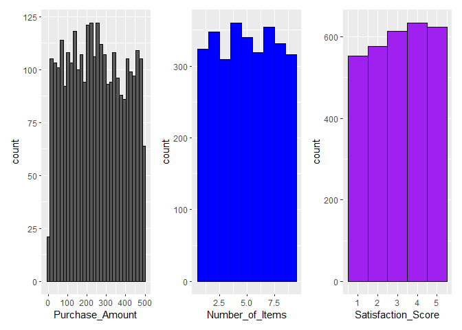<!-- -->

``` r
p1<-ggplot()+
      geom_boxplot(aes(y=Purchase_Amount), data=econ_data, color = "black")

p2<-ggplot()+
      geom_boxplot(aes(y=Number_of_Items), data=econ_data,bins= 9, color="black", fill="blue")
```

    ## Warning in geom_boxplot(aes(y = Number_of_Items), data = econ_data, bins = 9, :
    ## Ignoring unknown parameters: `bins`

``` r
p3<-ggplot()+
      geom_boxplot(aes(y=Satisfaction_Score), data=econ_data, bins=5, color="black", fill="purple")
```

    ## Warning in geom_boxplot(aes(y = Satisfaction_Score), data = econ_data, bins =
    ## 5, : Ignoring unknown parameters: `bins`

``` r
p1+p2+p3
```

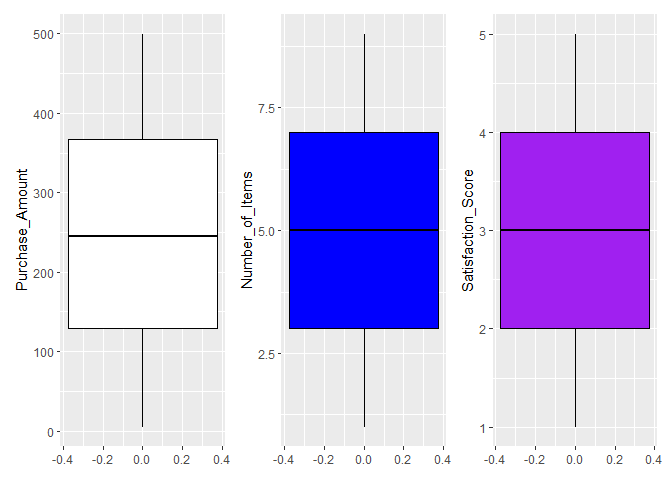<!-- -->

Compute measures of central tendency (mean, median, mode) and spread
(variance, standard deviation, IQR) for Purchase_Amount.

``` r
mean_purch<-mean(econ_data$Purchase_Amount)
median_purch<-median(econ_data$Purchase_Amount)
mode_purch<-names(sort(-table(econ_data$Purchase_Amount)))[1]


var_purch<-var(econ_data$Purchase_Amount)
sd_purch<-sd(econ_data$Purchase_Amount)
IQR_purch<-IQR(econ_data$Purchase_Amount)


summary_df <- data.frame(
  Statistic = c("Mean", "Median", "Mode", "Variance", "Standard Deviation", "Interquartile Range"),
  Value = c(mean_purch, median_purch, mode_purch, var_purch, sd_purch, IQR_purch)
)


print(summary_df)
```

    ##             Statistic            Value
    ## 1                Mean        247.96254
    ## 2              Median           245.09
    ## 3                Mode            29.33
    ## 4            Variance 19845.9862093515
    ## 5  Standard Deviation 140.875782905904
    ## 6 Interquartile Range          238.505

Compare the distribution of Browsing_Time and Purchase_Amount across
different Gender groups using density plots.

## Density plot of Purchase Amount

``` r
ggplot(data=econ_data, aes(x=Purchase_Amount, group=Gender, fill=Gender, alpha=0.5)) +
  geom_density(adjust=1.5) 
```

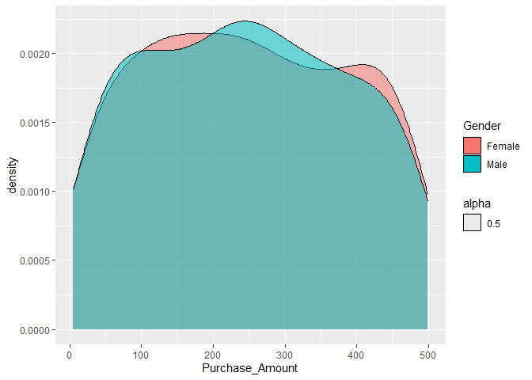<!-- -->

## Density plot of Browsing time

``` r
ggplot(data=econ_data, aes(x=Browsing_Time, group=Gender, fill=Gender, alpha=0.5)) +
  geom_density(adjust=1.5) 
```

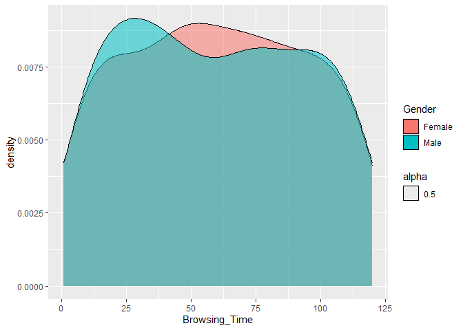<!-- -->

Apply a logarithmic or square root transformation on Browsing_Time and
evaluate changes in skewness.

``` r
econ_data<-econ_data%>%
  mutate(Log_Browsing_Time=log(Browsing_Time))

skewness(econ_data$Log_Browsing_Time)
```

    ## [1] -1.364966

This indicates a left-skewed distribution

Fit a simple linear regression model predicting Purchase_Amount based on
Browsing_Time. Interpret the results.

``` r
model<-lm(Purchase_Amount~Browsing_Time, data=econ_data)
summary(model)
```

    ## 
    ## Call:
    ## lm(formula = Purchase_Amount ~ Browsing_Time, data = econ_data)
    ## 
    ## Residuals:
    ##      Min       1Q   Median       3Q      Max 
    ## -244.867 -120.473   -2.946  118.246  254.069 
    ## 
    ## Coefficients:
    ##                Estimate Std. Error t value Pr(>|t|)    
    ## (Intercept)   252.65596    5.17524  48.820   <2e-16 ***
    ## Browsing_Time  -0.07839    0.07501  -1.045    0.296    
    ## ---
    ## Signif. codes:  0 '***' 0.001 '**' 0.01 '*' 0.05 '.' 0.1 ' ' 1
    ## 
    ## Residual standard error: 140.9 on 2998 degrees of freedom
    ## Multiple R-squared:  0.0003642,  Adjusted R-squared:  3.075e-05 
    ## F-statistic: 1.092 on 1 and 2998 DF,  p-value: 0.2961

Since the p value is \> than 0.05, there are no strong evidence that
Browsing_Time significantly affects Purchase_Amount. Moreover, Looking
at the intercept, as Browsing_Time = 0: Purchase_Amount is 252.65596 on
average.

Use ggplot2 (or equivalent) to create scatter plots and regression
lines.

``` r
res_purch <- resid(model)
econ_data$res_purch <- res_purch

ggplot(data=econ_data, aes(x=Browsing_Time, y=res_purch)) +
  geom_point()+
  geom_smooth()
```

    ## `geom_smooth()` using method = 'gam' and formula = 'y ~ s(x, bs = "cs")'

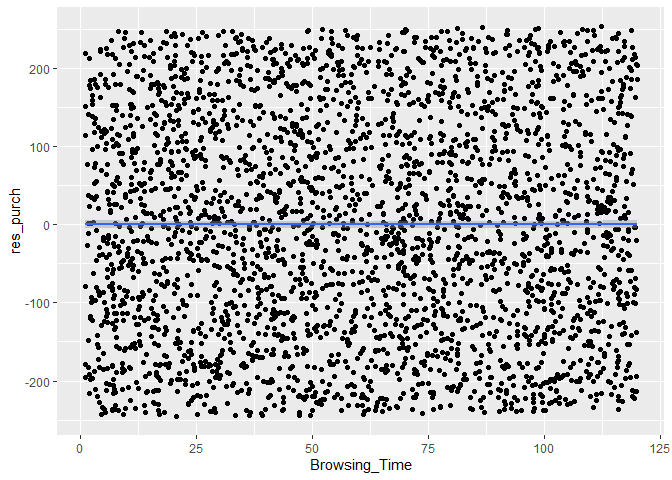<!-- -->

## Unit 2: Bivariate Data Analysis

Create scatter plots to explore the relationship between Purchase_Amount
and Number_of_Items.

``` r
ggplot(data=econ_data, aes(x=Number_of_Items, y=Purchase_Amount)) +
  geom_point()
```

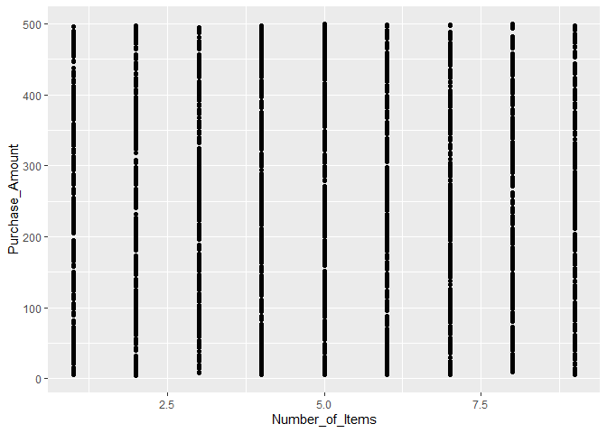<!-- --> As
Number_of_Items increases, the Purchase_Amount still varies across
0-500. This can indicate that there are products that have higher value
than others. Moreover, since Purchase_Amount vary across all points,
this indicates that there are no clear relationship between
Number_of_Items and Purchase_Amount.

Fit a polynomial regression model for Purchase_Amount and Browsing_Time
and compare it with a simple linear model.

``` r
model<-lm(Purchase_Amount~poly(Browsing_Time, 2), data=econ_data)

res_purch_poly <- resid(model)
econ_data$res_purch_poly <- res_purch_poly

p1<-ggplot(data=econ_data, aes(x=Browsing_Time, y=res_purch_poly)) +
      geom_point()+
      geom_smooth()

p2<-ggplot(data=econ_data, aes(x=Browsing_Time, y=res_purch)) +
      geom_point()+
      geom_smooth()

p1+p2
```

    ## `geom_smooth()` using method = 'gam' and formula = 'y ~ s(x, bs = "cs")'
    ## `geom_smooth()` using method = 'gam' and formula = 'y ~ s(x, bs = "cs")'

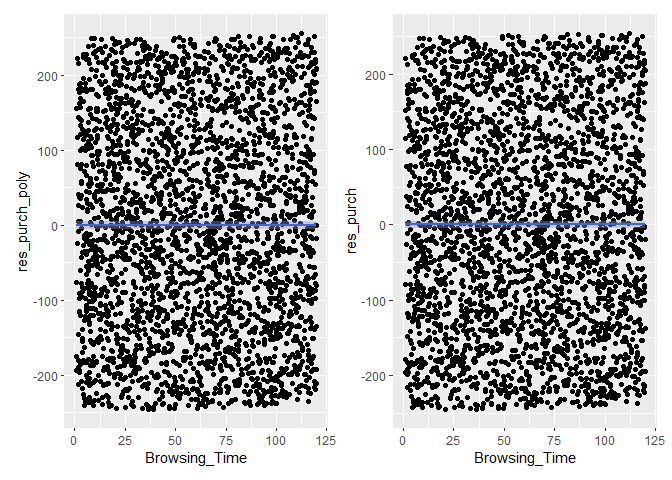<!-- -->
Comparing the two plots of the models, there are no difference between
the two.

Apply LOESS (Locally Estimated Scatterplot Smoothing) to Purchase_Amount
vs. Browsing_Time and visualize the results.

``` r
ggplot(data=econ_data, aes(x=Browsing_Time, y=res_purch)) +
  geom_point()+
  geom_smooth(method="loess", span=0.4, se=TRUE)
```

    ## `geom_smooth()` using formula = 'y ~ x'

<!-- -->
Despite the few fluctuations due to the loess, it still shows that there
are no strong relationship between the two.

Compare robust regression methods (Huber or Tukey regression) with
ordinary least squares (OLS).

``` r
huber_model <- rlm(Purchase_Amount ~ Browsing_Time, data = econ_data, psi = psi.huber)
summary(huber_model)
```

    ## 
    ## Call: rlm(formula = Purchase_Amount ~ Browsing_Time, data = econ_data, 
    ##     psi = psi.huber)
    ## Residuals:
    ##      Min       1Q   Median       3Q      Max 
    ## -244.818 -120.331   -2.848  118.291  254.289 
    ## 
    ## Coefficients:
    ##               Value    Std. Error t value 
    ## (Intercept)   252.6462   5.3363    47.3448
    ## Browsing_Time  -0.0803   0.0773    -1.0378
    ## 
    ## Residual standard error: 176.9 on 2998 degrees of freedom

``` r
ols_model <- lm(Purchase_Amount ~ Browsing_Time, data = econ_data)
summary(ols_model)
```

    ## 
    ## Call:
    ## lm(formula = Purchase_Amount ~ Browsing_Time, data = econ_data)
    ## 
    ## Residuals:
    ##      Min       1Q   Median       3Q      Max 
    ## -244.867 -120.473   -2.946  118.246  254.069 
    ## 
    ## Coefficients:
    ##                Estimate Std. Error t value Pr(>|t|)    
    ## (Intercept)   252.65596    5.17524  48.820   <2e-16 ***
    ## Browsing_Time  -0.07839    0.07501  -1.045    0.296    
    ## ---
    ## Signif. codes:  0 '***' 0.001 '**' 0.01 '*' 0.05 '.' 0.1 ' ' 1
    ## 
    ## Residual standard error: 140.9 on 2998 degrees of freedom
    ## Multiple R-squared:  0.0003642,  Adjusted R-squared:  3.075e-05 
    ## F-statistic: 1.092 on 1 and 2998 DF,  p-value: 0.2961

``` r
ggplot(econ_data, aes(x = Browsing_Time, y = Purchase_Amount)) +
  geom_point(alpha = 0.5, color = "gray") +  # Scatter plot
  geom_smooth(method = "lm", color = "blue", se = FALSE, linetype = "dashed") +  
  geom_abline(slope = coef(huber_model)[2], intercept = coef(huber_model)[1], color = "red", size = 1.2, alpha = 0.4)  
```

    ## Warning: Using `size` aesthetic for lines was deprecated in ggplot2 3.4.0.
    ## ℹ Please use `linewidth` instead.
    ## This warning is displayed once every 8 hours.
    ## Call `lifecycle::last_lifecycle_warnings()` to see where this warning was
    ## generated.

    ## `geom_smooth()` using formula = 'y ~ x'

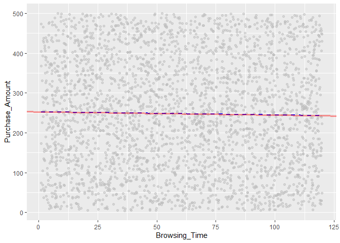<!-- -->

Comparing the 2 models, OLS should be more sensitive on outliers.
However, in the graph shown, the 2 lines are almost the same. This can
also be seen at the summary where both have minor difference resulting
into minor changes.

## Unit 3: Trivariate/Hypervariate Data Analysis

Explore interaction effects between Browsing_Time and Category on
Purchase_Amount using interaction plots.

``` r
ggplot(econ_data, aes(x = Browsing_Time, y = Purchase_Amount, color = Category)) +
  geom_smooth(method = "lm", se = FALSE) 
```

    ## `geom_smooth()` using formula = 'y ~ x'

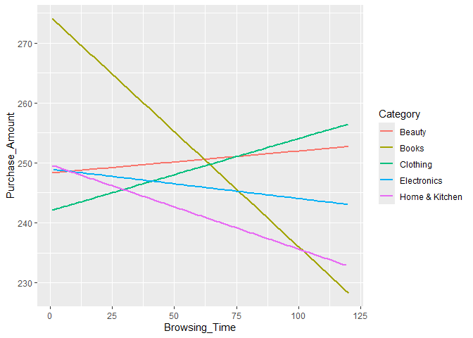<!-- --> The
lines indicate a separate interaction between categories on the
Purchase_Amount and Browsing_Time. There are categories such as books
and home & kitchen with a negative relationship between the 2 variables
whilst there are also positive relationships such as clothing and
beauty.

Create coplots of Purchase_Amount against Browsing_Time for different
levels of Category.

``` r
ggplot(econ_data, aes(x = Browsing_Time, y = res_purch)) +
  geom_point(alpha = 0.4, color = "blue") +
  geom_smooth(method = "lm", se = TRUE, color = "red") +
  facet_wrap(~ Category)
```

    ## `geom_smooth()` using formula = 'y ~ x'

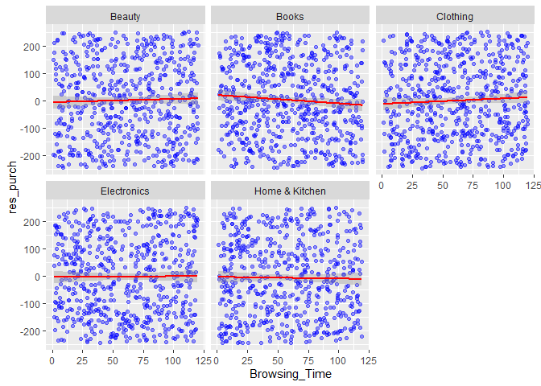<!-- -->

``` r
ggplot(econ_data, aes(x = Browsing_Time, y = Number_of_Items, z = Purchase_Amount)) +
  geom_density_2d_filled()
```

    ## Warning: The following aesthetics were dropped during statistical transformation: z.
    ## ℹ This can happen when ggplot fails to infer the correct grouping structure in
    ##   the data.
    ## ℹ Did you forget to specify a `group` aesthetic or to convert a numerical
    ##   variable into a factor?

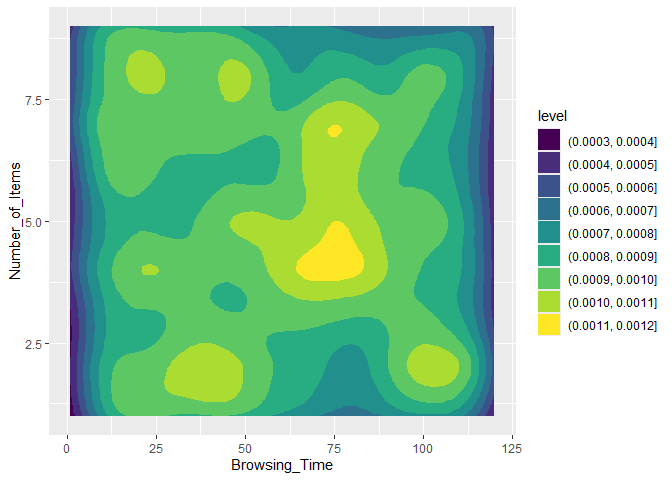<!-- -->

This indicate that the highest density region such as the yellow region
shows most common behaviours in terms of browsing time and number of
items.

Perform multiple regression with Purchase_Amount as the dependent
variable and Browsing_Time, Number_of_Items, and Satisfaction_Score as
predictors. Perform model selection and assess variable importance.

``` r
model_multi<-lm(Purchase_Amount~Browsing_Time+Number_of_Items+Satisfaction_Score ,data=econ_data)
summary(model_multi)
```

    ## 
    ## Call:
    ## lm(formula = Purchase_Amount ~ Browsing_Time + Number_of_Items + 
    ##     Satisfaction_Score, data = econ_data)
    ## 
    ## Residuals:
    ##      Min       1Q   Median       3Q      Max 
    ## -250.668 -120.856   -2.846  118.899  255.664 
    ## 
    ## Coefficients:
    ##                     Estimate Std. Error t value Pr(>|t|)    
    ## (Intercept)        261.34993    9.24929  28.256   <2e-16 ***
    ## Browsing_Time       -0.07954    0.07504  -1.060    0.289    
    ## Number_of_Items     -0.78321    1.00497  -0.779    0.436    
    ## Satisfaction_Score  -1.53871    1.83444  -0.839    0.402    
    ## ---
    ## Signif. codes:  0 '***' 0.001 '**' 0.01 '*' 0.05 '.' 0.1 ' ' 1
    ## 
    ## Residual standard error: 140.9 on 2996 degrees of freedom
    ## Multiple R-squared:  0.0007932,  Adjusted R-squared:  -0.0002073 
    ## F-statistic: 0.7928 on 3 and 2996 DF,  p-value: 0.4978

Stepwise Regression:

``` r
stepwise<-step(model_multi, direction="both")
```

    ## Start:  AIC=29691.89
    ## Purchase_Amount ~ Browsing_Time + Number_of_Items + Satisfaction_Score
    ## 
    ##                      Df Sum of Sq      RSS   AIC
    ## - Number_of_Items     1     12056 59482958 29691
    ## - Satisfaction_Score  1     13966 59484867 29691
    ## - Browsing_Time       1     22299 59493201 29691
    ## <none>                            59470902 29692
    ## 
    ## Step:  AIC=29690.5
    ## Purchase_Amount ~ Browsing_Time + Satisfaction_Score
    ## 
    ##                      Df Sum of Sq      RSS   AIC
    ## - Satisfaction_Score  1     13479 59496437 29689
    ## - Browsing_Time       1     21541 59504498 29690
    ## <none>                            59482958 29691
    ## + Number_of_Items     1     12056 59470902 29692
    ## 
    ## Step:  AIC=29689.18
    ## Purchase_Amount ~ Browsing_Time
    ## 
    ##                      Df Sum of Sq      RSS   AIC
    ## - Browsing_Time       1     21676 59518113 29688
    ## <none>                            59496437 29689
    ## + Satisfaction_Score  1     13479 59482958 29691
    ## + Number_of_Items     1     11569 59484867 29691
    ## 
    ## Step:  AIC=29688.27
    ## Purchase_Amount ~ 1
    ## 
    ##                      Df Sum of Sq      RSS   AIC
    ## <none>                            59518113 29688
    ## + Browsing_Time       1     21676 59496437 29689
    ## + Satisfaction_Score  1     13614 59504498 29690
    ## + Number_of_Items     1     10822 59507290 29690

``` r
summary(stepwise)
```

    ## 
    ## Call:
    ## lm(formula = Purchase_Amount ~ 1, data = econ_data)
    ## 
    ## Residuals:
    ##      Min       1Q   Median       3Q      Max 
    ## -242.933 -119.268   -2.873  119.237  251.647 
    ## 
    ## Coefficients:
    ##             Estimate Std. Error t value Pr(>|t|)    
    ## (Intercept)  247.963      2.572   96.41   <2e-16 ***
    ## ---
    ## Signif. codes:  0 '***' 0.001 '**' 0.01 '*' 0.05 '.' 0.1 ' ' 1
    ## 
    ## Residual standard error: 140.9 on 2999 degrees of freedom

Using the stepwise model, we can tell that it removed all the predictors
leaving behind Purchase_Amount alone. This indicates that the 3
predictors did not have significance value in explaining
Purchase_Amount.
